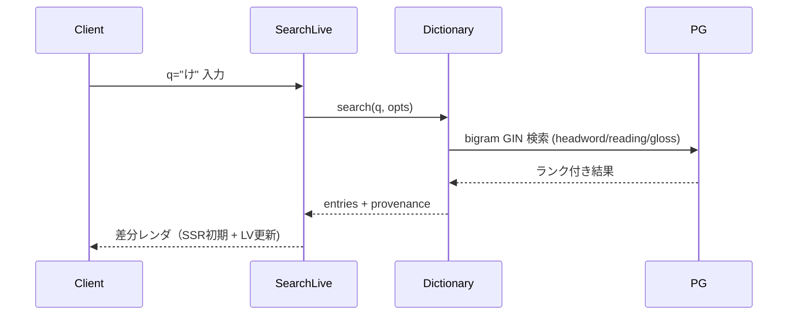
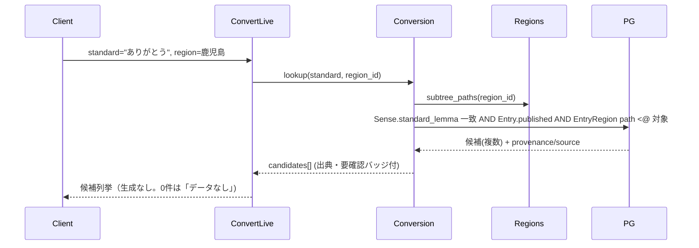
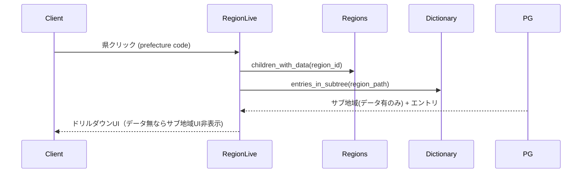

# dialect-pouch MVP Design

## Overview
Phoenix（Elixir）の単一アプリで、LiveView による SSR + WebSocket 差分 UI を中核に据える。データは PostgreSQL に集約し、地域階層は `ltree`、地図ポリゴンは `PostGIS`、日本語全文検索は `pg_bigm`（バイグラム）で実現する。取り込み・LLM 補完は `Oban` の永続ジョブで回す。変換は「生成」を一切使わず DB ルックアップに限定する。配信は `mix release` を systemd もしくは Docker で起動し、NGINX を前段に置く（VPS / オンプレ）。

## Architecture

### Phoenix Contexts（ドメイン境界）
- **Regions**: 地域階層ツリーと地理情報（`ltree` パス + PostGIS `geom`）。サブツリー絞り込みクエリを提供。
- **Dictionary**: 方言エントリ（`Entry` / `Sense` / `Example`）と出典（`Provenance` / `Source`）。検索・取得・slug 解決。
- **Conversion**: DB ルックアップによる語/言い回し変換、文章内マッチ置換（標準語見出しの最長一致スキャン）。
- **Contributions**: ユーザー投稿の受付・状態管理（未承認 → 承認/却下)。
- **Ingestion**: Oban ジョブ（オープンデータ取り込み・LLM 補完・重複統合・再試行)。
- **Accounts**: キュレーター（管理者）認証。`phx.gen.auth` ベース。

各 Context は Ecto スキーマと公開関数（境界 API）のみを外部に晒し、内部クエリは隠蔽する。LiveView / Controller は Context 関数だけを呼ぶ。

### システム構成

```mermaid
flowchart LR
  Browser["ブラウザ (SSR HTML + LiveView socket)"] -->|HTTP/WS| NGINX
  NGINX --> Phoenix["Phoenix App (mix release)"]
  Phoenix --> PG[("PostgreSQL\n+ ltree + PostGIS + pg_bigm")]
  Oban["Oban Workers"] --> PG
  Oban -->|enrich (curator batch)| LLM["LLM Provider (任意)"]
  Phoenix --> Oban
```

### 主要ページとルーティング
| パス | 種別 | 内容 |
|------|------|------|
| `/` | LiveView | トップ（検索ボックス + 地図入口 + 新着) |
| `/search?q=` | LiveView | 検索結果一覧（SSR、ページネーション) |
| `/e/:slug` | LiveView | エントリ個別（SSR・JSON-LD・出典) |
| `/r/:region_path` | LiveView | 地域ページ（地図ドリルダウン + エントリ一覧) |
| `/convert` | LiveView | 変換（語/言い回し + 文章内置換) |
| `/contribute` | LiveView | 投稿フォーム |
| `/admin/*` | LiveView | モデレーション（認証必須) |
| `/sitemap.xml` | Controller | サイトマップ（SEO) |

## Data Flow

### 検索（US-001 / FR-003）


### 語変換（US-004 / FR-005）


### 地図ドリルダウン（US-003）


## Data Models（Ecto スキーマ）

> 表記は Elixir/Ecto。型はマイグレーション基準。

```elixir
# Region: 階層ツリー（国 > 都道府県 > 地域/方言圏）
schema "regions" do
  field :name, :string                      # 例: "鹿児島県", "奄美"
  field :level, Ecto.Enum,
        values: [:country, :prefecture, :area]
  field :code, :string                      # 都道府県コード等（任意）
  field :path, Ltree                         # 例: "jp.kagoshima.amami"（サブツリー絞り込み）
  field :geom, Geo.PostGIS.Geometry          # 地図ポリゴン（任意・将来描画用）
  belongs_to :parent, Region
  timestamps()
end
# index: GiST(path), GiST(geom), unique(path)

# Entry: 方言の見出し語/言い回し（方言側）
schema "entries" do
  field :slug, :string                       # 永続パーマリンク（unique）
  field :headword, :string                   # 見出し（方言表記）例: "だんだん"
  field :reading, :string                    # 読み（かな）
  field :norm, :string                       # 検索用正規化（bigram対象）
  field :status, Ecto.Enum,
        values: [:draft, :published, :rejected], default: :draft
  has_many :senses, Sense
  has_many :examples, Example
  has_many :entry_regions, EntryRegion
  has_one  :provenance, Provenance
  timestamps()
end
# index: unique(slug), GIN(norm gin_bigm_ops), GIN(reading gin_bigm_ops)

# Sense: エントリの意味（標準語 gloss）。変換の標準語インデックスを兼ねる
schema "senses" do
  belongs_to :entry, Entry
  field :gloss, :string                      # 標準語の意味（表示用）例: "ありがとう"
  field :standard_lemma, :string             # 変換マッチ用の正規化標準語（nullable）
  field :note, :string
end
# index: GIN(gloss gin_bigm_ops), btree(standard_lemma)

# Example: 用例
schema "examples" do
  belongs_to :entry, Entry
  field :text, :string                       # 方言の用例
  field :translation, :string               # 標準語訳
end

# EntryRegion: エントリ × 地域（任意階層に複数紐付け）
schema "entry_regions" do
  belongs_to :entry, Entry
  belongs_to :region, Region
end
# unique(entry_id, region_id)

# Provenance: 出典・素性（第一級）
schema "provenances" do
  belongs_to :entry, Entry
  field :kind, Ecto.Enum,
        values: [:open_data, :manual, :user, :llm_assisted]
  field :verified, :boolean, default: false  # llm_assisted の検証状態
  field :contributor_nickname, :string       # kind=user のみ
  belongs_to :source, Source                  # kind=open_data 推奨
end

# Source: 出典マスタ
schema "sources" do
  field :name, :string
  field :url, :string
  field :license, :string
end

# AdminUser: キュレーター（phx.gen.auth）
schema "admin_users" do
  field :email, :string
  field :hashed_password, :string
  timestamps()
end
```

### 変換の整合ルール（重要）
- 標準語→方言：`Sense.standard_lemma` を正規化（小書き・記号除去・かな統一）して完全一致。曖昧時はバイグラム近傍を「候補」として別枠提示。
- 方言→標準語：`Entry.norm` 一致 → 当該 `senses.gloss` を返す。
- 文章内置換（サブ）：入力文を、対象地域配下に存在する `standard_lemma` 集合に対し**最長一致グリーディスキャン**で走査（形態素解析器に依存しない）。一致スパンのみ置換・ハイライト、未一致は無改変。複数候補語は既定を適用し他候補を選択可能に。

## API Design
MVP は LiveView 主体（内部は Context 関数呼び出し）。将来のネイティブアプリ用に同じ Context を薄い JSON API で再公開できる構造を保つ（MVP では `/api/*` は最小限のみ、もしくは未実装で可)。

| Method | Endpoint | 用途 | 認証 |
|--------|----------|------|------|
| GET | `/search?q=&region=` | 検索（HTML/LV) | 不要 |
| GET | `/e/:slug` | エントリ取得（SSR) | 不要 |
| GET | `/r/:region_path` | 地域取得（SSR) | 不要 |
| POST | `/contribute` (LV submit) | 投稿（未承認で保存) | 不要（レート制限) |
| GET/POST | `/admin/moderation` (LV) | 承認/却下 | 管理者 |
| GET | `/sitemap.xml` | サイトマップ | 不要 |

## Error Handling
- **検索 0 件**: 200 で「該当なし」+ 部分一致/表記ゆれ候補を返す（例外にしない)。
- **変換 0 件**: 「データなし」を明示し、生成結果は返さない（FR-005)。
- **エントリ未存在 slug**: 404 ページ（SEO 配慮の noindex)。
- **投稿バリデーション失敗**: changeset エラーをフォームにインライン表示、422 相当。
- **投稿レート超過**: 429 相当で投稿拒否、再試行時刻を提示。
- **取り込みジョブ失敗**: Oban の retry（指数バックオフ)。失敗レコードは `failed` で隔離し再投入可能。
- **LLM 失敗/未設定**: 補完ジョブをスキップしログ記録。ユーザー体験には影響させない（MVP の LLM は運営バッチのみ)。

## Security Considerations
- **入力サニタイズ/XSS**: LiveView の自動エスケープを基本とし、ユーザー入力（投稿・変換文）は HTML を一切信頼しない。
- **投稿レート制限**: IP/セッション単位で単位時間あたり上限（`Hammer` 等）。
- **管理者認証**: `phx.gen.auth`。`/admin/*` は `on_mount` で認可。
- **provenance 改ざん防止**: provenance/verified の変更は管理者 Context 経由のみ。
- **公開ゲート**: `status=published` のみ一般公開。未検証 `llm_assisted` は既定非公開、公開時は「要確認」バッジ必須（NFR)。

## SEO / SSR
- 全公開ページは LiveView の dead render で SSR HTML を返す。
- `/e/:slug`・`/r/:region_path` に title・meta description・JSON-LD（`DefinedTerm` 相当）を出力。
- `/sitemap.xml` を Oban 定期ジョブで再生成。404 は noindex。

## Region 階層と地図
- サブツリー絞り込み：`region.path <@ $1`（ltree GiST 索引)。「県とその配下」を 1 クエリ。
- MVP 地図：47 都道府県の静的 SVG（県コード対応）+ LiveView クリックイベント。サブ地域はリスト型ドリルダウン（データのある地域のみ表示)。
- PostGIS `geom` は将来のポリゴン描画/近傍検索用に保持（MVP は必須描画には使わない)。

## UI / UX の責務分離（重要）
ビジュアルデザイン（色・余白・装飾・タイポ）は後工程で「claude design」GUI にディレクトリを読ませて調整する。したがって本実装は **UX（挙動・状態・インタラクション)をコード側で確定**させ、**ビジュアルは差し替え可能な薄い層**に留める。

- **コンポーネント設計**: 画面は HEEx の function component（`core_components` 拡張）に分割し、見た目と無関係な構造境界を明確にする。GUI から再スタイルしても UX ロジックが壊れない粒度にする。
- **スタイル層**: Tailwind ユーティリティクラスを使い、装飾は後から GUI で差し替えやすい最小限に留める（独自 CSS の作り込みはしない)。配色・余白は暫定。
- **UX はコードで確定（GUI 任せにしない)**:
  - 検索: 入力に応じた即時反映（debounce）、ローディング状態、空状態（候補提示)。
  - 地図: クリック→ドリルダウンの状態遷移、データ無し地域の非活性表現、選択中ハイライト。
  - 変換: 入力に対するライブプレビュー、候補列挙、0 件の「データなし」明示、要確認バッジ。
  - 投稿: インラインバリデーション、送信中/完了/レート超過のフィードバック。
  - 共通: フォーカス遷移・キーボード操作・エラー表示などアクセシビリティ挙動。
- **データ属性**: GUI で要素を識別・再配置しやすいよう、主要ブロックに意味のある `id` / `data-*` を付ける。

## Testing Strategy
- **Unit**: 変換ルール（正規化・最長一致スキャン）、ltree サブツリークエリ、provenance 公開ゲート、検索ランキング。
- **Integration（Context）**: Dictionary/Conversion/Regions/Contributions/Ingestion の境界関数を DB 込みでテスト（重複統合・モデレーション状態遷移含む)。
- **LiveView テスト**: 検索入力→結果、地図クリック→ドリルダウン、変換 0 件表示、投稿バリデーション、管理者認可。
- **E2E シナリオ**: ①検索→エントリ着地（SSR/JSON-LD 検証）②地図→ドリルダウン ③語変換（候補・出典・0件) ④投稿→モデレーション承認→公開 ⑤取り込みジョブ→重複統合。
- **Seed**: 数県分の高精度シードデータ（手動キュレーション）でテスト・初期表示を担保。
